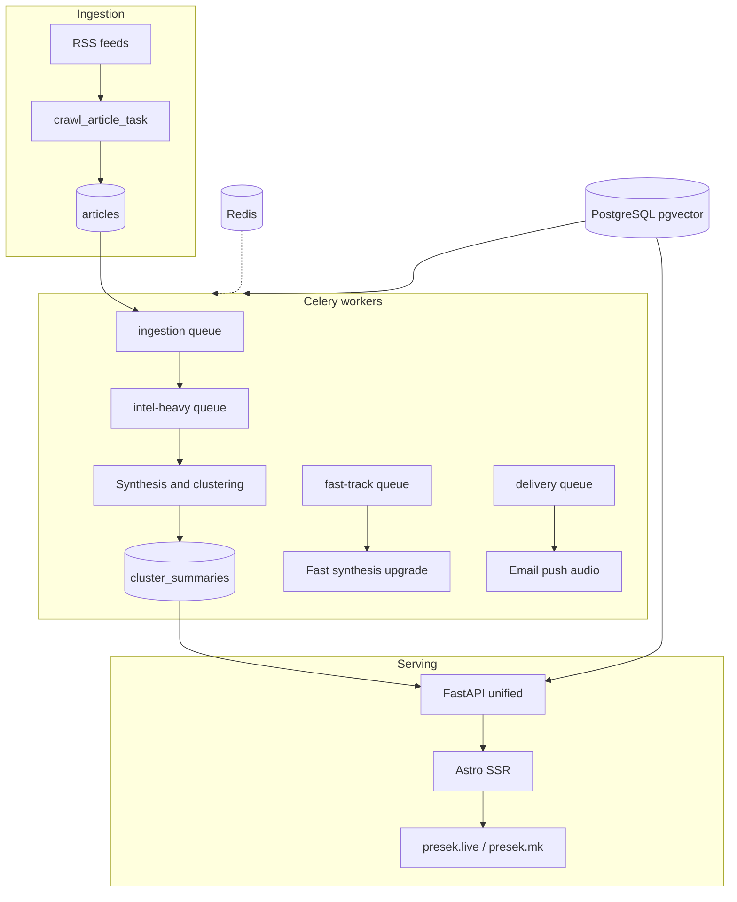

# Presek

Presek is a news aggregation and analysis app with:

- a FastAPI backend at the repo root
- an Astro frontend in [web](web)
- deployment/runtime helpers in [deploy](deploy)

## Architecture



### Production systemd services

Presek runs as a **systemd target** (`presek.target`). See [deploy/MINIMUM_PROD.md](deploy/MINIMUM_PROD.md) for incident runbooks.

| Service | Must run? | If stopped |
|---------|-----------|------------|
| `presek-fastapi-unified` | Yes | API and `/api/*` broken |
| `presek-astro` | Yes | Frontend SSR/static broken |
| `presek-worker-ingestion` | Yes | No new articles ingested |
| `presek-worker` (intel-heavy) | Yes | Synthesis backlog grows |
| `presek-beat` | Yes | Scheduled tasks stop |
| `presek-worker-fasttrack` | Mostly | Breaking news summaries slow |
| `presek-worker-delivery` | Yes | Newsletter/push delivery stops |
| `presek-worker-maintenance` | Yes | DB maintenance and backfill stall |

## Current Structure

- `web/` is the only active frontend.
- The older root Vite frontend and Jinja template frontend were removed.
- `start.sh` is a local/manual runtime helper, not the production entrypoint.
- Production serves from the release runtime root at `/home/emiloffingen/presek-runtime/current` behind nginx/systemd.
- `docker-compose.yml` is a **dev-only** backend stub (API + workers + Postgres + Redis). It does not run Astro SSR; use `cd web && npm run dev` for the frontend locally.

## Runtime Paths

- Local/manual repo path: `./start.sh`
- Supported production path:
  1. `APP_ROOT=/home/emiloffingen/presek-runtime bash deploy/bootstrap_runtime_root.sh`
  2. `sudo APP_ROOT=/home/emiloffingen/presek-runtime INSTALL_NGINX=0 bash deploy/install_server.sh`
  3. `APP_ROOT=/home/emiloffingen/presek-runtime DEPLOY_GIT_DIR=/home/emiloffingen/presek bash deploy/ci_deploy.sh`

If a change touches `deploy/systemd/*` or `deploy/install_server.sh`, run step 2 before step 3 so the installed units match the release code.

## Dependencies

- Python dependencies are managed with **uv** via `pyproject.toml` and `uv.lock`.
- `requirements.txt` is kept for compatibility with older tooling; regenerate it after dependency changes if needed.

## Common Commands

Backend tests:

```sh
.venv/bin/python3 -m pytest -q
```

Frontend tests:

```sh
cd web && npm test
```

Frontend build:

```sh
cd web && npm run build
```

## Manual Provider Checks

Ad hoc provider/key probes now live in [scripts](/home/emiloffingen/presek/scripts):

- `scripts/manual_check_ai_cascade.py`
- `scripts/manual_check_cloudflare.py`
- `scripts/manual_check_keys.py`

## License

MIT. See [LICENSE](LICENSE). Third-party dependencies keep their own licenses; news content shown on the site belongs to its original publishers (see the site's Terms of Use).
